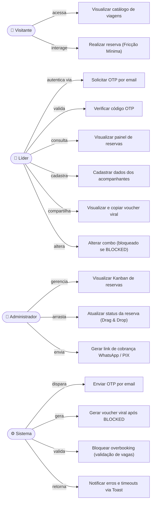
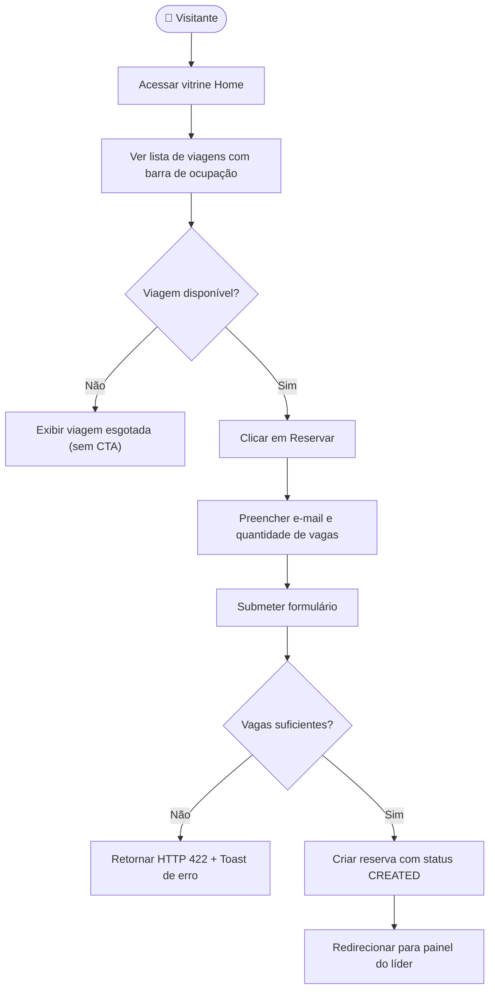
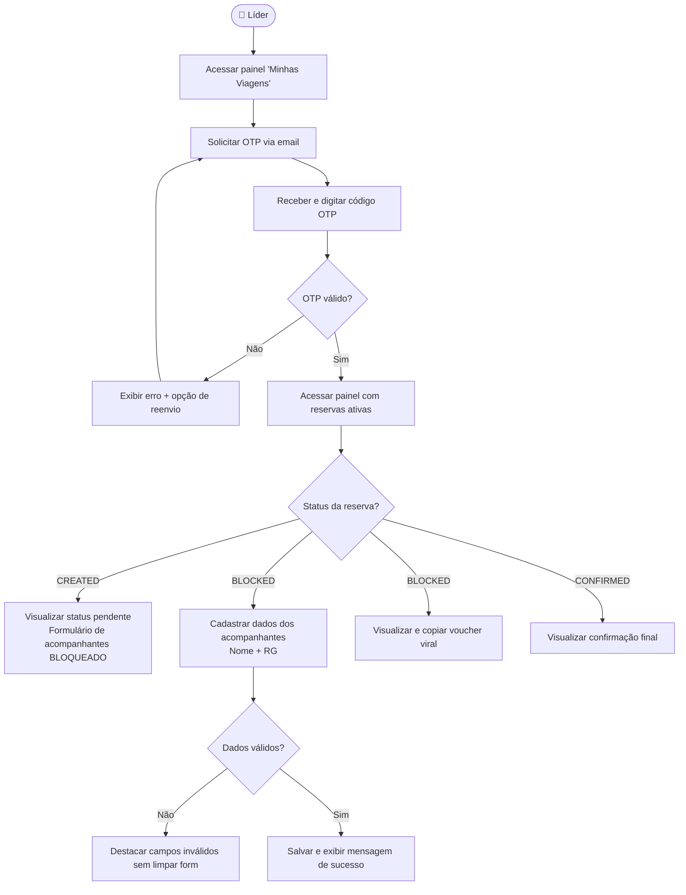
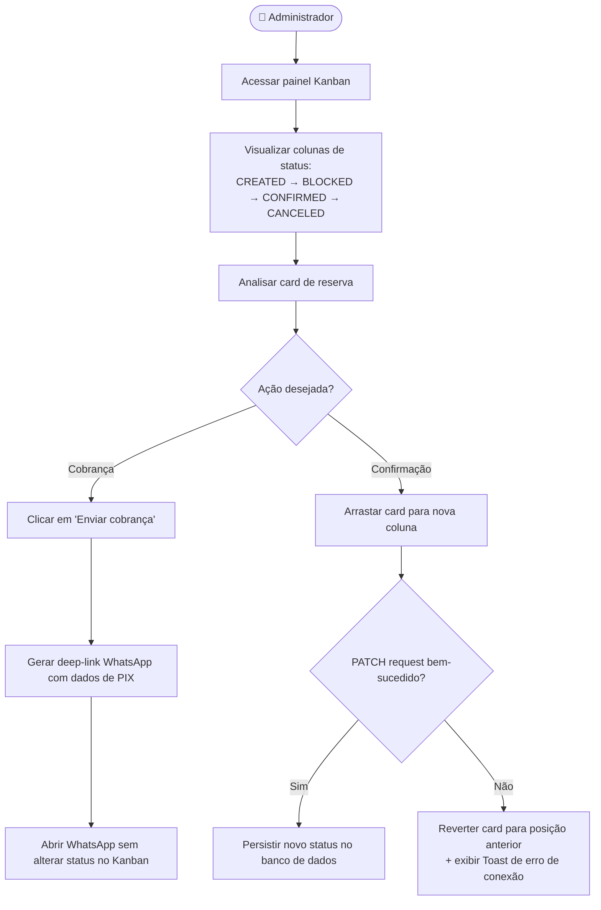
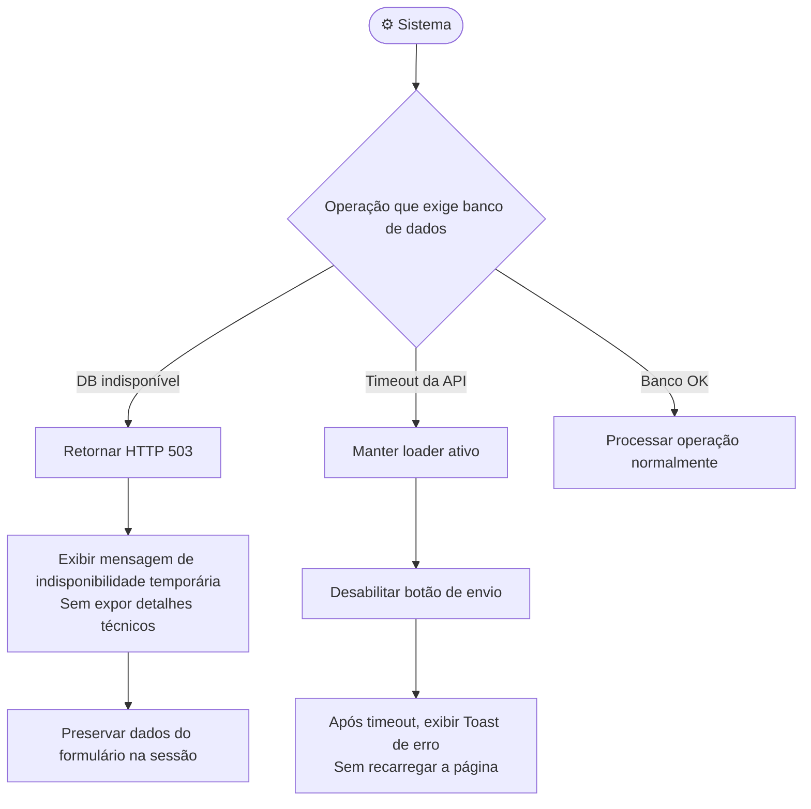

# Casos de Uso — Sistema Viaje Bem

## Resumo por Ator

### 👤 Visitante (não autenticado)
| UC | Caso de Uso |
|---|---|
| UC-01 | Visualizar catálogo de viagens com barra de ocupação |
| UC-02 | Realizar reserva informando e-mail e quantidade de vagas |

### 👤 Líder (autenticado via OTP)
| UC | Caso de Uso |
|---|---|
| UC-03 | Solicitar código OTP por e-mail |
| UC-04 | Verificar OTP e autenticar-se no painel |
| UC-05 | Visualizar reservas ativas com status atualizado |
| UC-06 | Cadastrar nome e RG dos acompanhantes (apenas se `BLOCKED`) |
| UC-07 | Visualizar e copiar o voucher viral |
| UC-08 | Tentar alterar o combo — bloqueado após `BLOCKED` |

### 👤 Administrador
| UC | Caso de Uso |
|---|---|
| UC-09 | Criar e publicar novo pacote de viagem |
| UC-10 | Editar pacote existente (com proteção de vagas já reservadas) |
| UC-11 | Visualizar Kanban de reservas por status |
| UC-12 | Atualizar status de reserva via Drag & Drop |
| UC-13 | Gerar link de cobrança WhatsApp / PIX |

### ⚙️ Sistema (automatizado)
| UC | Caso de Uso |
|---|---|
| UC-14 | Enviar OTP por e-mail ao líder |
| UC-15 | Gerar voucher viral após transição para `BLOCKED` |
| UC-16 | Bloquear overbooking na criação de reserva |
| UC-17 | Notificar usuário com Toast em erros e timeouts |
| UC-18 | Preservar dados do formulário em caso de falha no banco |

---

# Casos de Uso — Sistema Viaje Bem

## Diagrama Geral de Atores

---

## UC-01: Fluxo do Visitante (Vitrine & Reserva)

---

## UC-02: Fluxo do Líder (Painel Autenticado)

---

## UC-03: Fluxo do Administrador (CRM Kanban)

---

## UC-04: Casos de Erro (Resiliência do Sistema)

